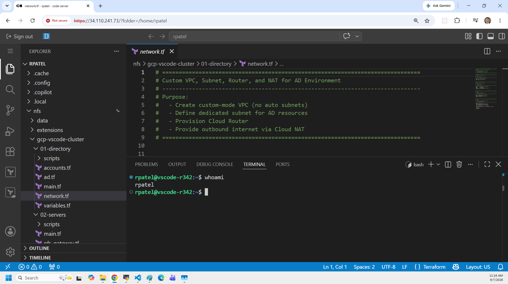
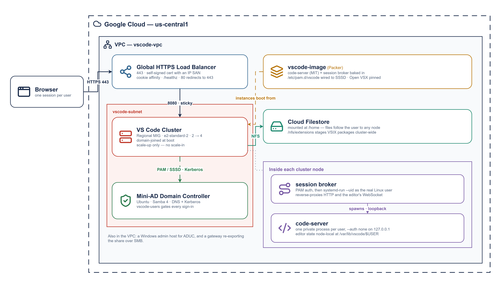
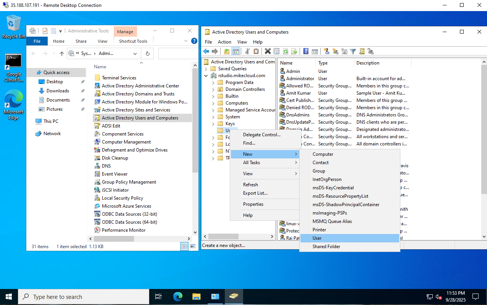
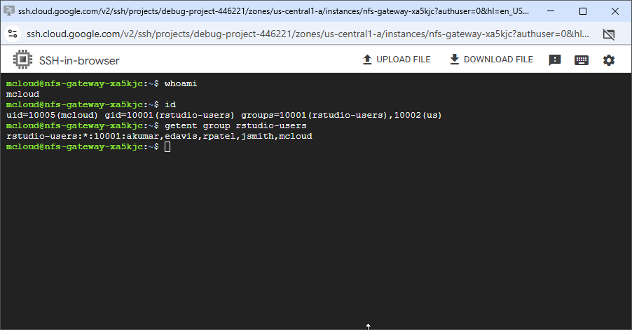

# Multi-User VS Code Cluster on Google Cloud

This project extends the **GCP Mini Active Directory** lab into a multi-user,
domain-joined **VS Code Server cluster** on Google Cloud. Users sign in with
their Active Directory credentials from a browser and get a private editor
running as their own POSIX identity, with a home directory shared across every
node in the cluster.



Each user gets their own `code-server` process rather than a shared one. A
session broker in front of the cluster authenticates against AD through PAM,
launches that process under the user's real UID, and reverse-proxies to it.
Home directories live on **Google Cloud Filestore**, so a user lands on the
same files no matter which node the load balancer sends them to.

### Key capabilities demonstrated

1. **VS Code Server cluster behind a global HTTPS load balancer** - `code-server`
   (open source, MIT) across a Managed Instance Group, fronted by a global
   external load balancer terminating TLS with session affinity.
2. **Per-user sessions via a PAM session broker** - one `code-server` process
   per signed-in user, launched as a transient systemd unit under that user's
   own UID.
3. **Filestore-backed home directories** - an NFS share mounted at `/home`, so
   user files follow them across nodes; editor state deliberately stays local.
4. **Mini Active Directory integration** - a Samba-based domain controller
   provides authentication and DNS, so logins are domain-based and centrally
   managed.



## Prerequisites

* [A Google Cloud Account](https://console.cloud.google.com/)
* [Install gcloud CLI](https://cloud.google.com/sdk/docs/install) 
* [Install Latest Terraform](https://developer.hashicorp.com/terraform/install)
* [Install Latest Packer](https://developer.hashicorp.com/packer/install)

If this is your first time watching our content, we recommend starting with this video: [GCP + Terraform: Easy Setup](https://youtu.be/3spJpYX4f7I). It provides a step-by-step guide to properly configure Terraform, Packer, and the gcloud CLI.

## Download this Repository  

Clone the repository from GitHub and move into the project directory:  

```bash
git clone https://github.com/mamonaco1973/gcp-vscode-cluster.git
cd gcp-vscode-cluster
```  


## Build the Code  

Run [check_env](check_env.sh) to validate your environment, then run [apply](apply.sh) to provision the infrastructure.  

```bash
develop-vm:~/gcp-vscode-cluster$ ./apply.sh
NOTE: Validating that required commands are in PATH.
NOTE: gcloud is found in the current PATH.
NOTE: terraform is found in the current PATH.
NOTE: All required commands are available.
NOTE: Checking Google Cloud CLI connection.
NOTE: Successfully authenticated with GCP.
Initializing provider plugins...
Terraform has been successfully initialized!
```  
## Build Results  

When the deployment completes, the following resources are created:  

- **Networking:**  
  - A custom VPC with dedicated subnets for Active Directory, MIG cluster nodes, and NFS Gateway.  
  - Route tables and firewall rules configured for outbound internet access, AD lookups, and Filestore access  

- **Security & Identity:**  
  - Firewall rules scoped to domain controller, MIG nodes, and NFS gateway  
  - Google Secret Manager entries for administrator and user credentials  
  - Service accounts and IAM roles for MIG instances to securely fetch secrets  

- **Active Directory Server:**  
  - Ubuntu VM running Samba 4 as Domain Controller and DNS server  
  - Configured Kerberos realm and NetBIOS name for authentication  
  - Administrator credentials securely stored in Secret Manager  

- **VS Code Cluster (MIG):**  
  - Linux Managed Instance Group (MIG) hosting `code-server` nodes built from a Packer-generated custom image  
  - Global external HTTPS Load Balancer terminating TLS, with health checks and cookie session affinity  
  - Port 80 redirects to 443; nothing is served in cleartext  
  - Autoscaling policies to add VS Code nodes based on CPU utilization  

- **Filestore Storage:**  
  - Google Cloud Filestore instance providing an NFSv3 share  
  - Mounted at `/home` for user home directories and `/nfs` for shared data  
  - `/nfs/extensions` holds VSIX files for extensions absent from Open VSX  

- **File Access Integration:**  
  - VS Code MIG instances mount the Filestore NFS share for home directories and project data  
  - A Linux gateway can optionally expose the same Filestore backend via Samba for Windows clients  
  - This provides a unified storage backend across Linux (NFS) and Windows (SMB) clients  

## How the Session Broker Works

The broker lives at [03-packer/broker/broker.py](03-packer/broker/broker.py) and runs as `vscode-broker.service` on every cluster node.

| Route | Behavior |
|-------|----------|
| `GET /healthz` | Unauthenticated health check for the load balancer |
| `GET /login` | Renders the sign-in form |
| `POST /login` | PAM authentication via SSSD, then sets a signed session cookie |
| `GET /session-starting` | Progress page shown while a session spawns |
| `GET /session-status` | JSON readiness poll used by that page |
| `GET /logout` | Stops the user's `code-server` process and clears the cookie |
| everything else | Reverse-proxied to the user's own `code-server` on `127.0.0.1` |

**Signing out.** `code-server` occupies the entire viewport and knows nothing about the broker's session, so the broker injects a small sign-out button into the workbench document. It mounts into the title bar and is styled from the workbench's own theme variables, so it tracks light/dark and custom themes. If no title bar is found, it falls back to floating at the top right. It opens a confirmation dialog, since signing out stops the user's `code-server` process and discards unsaved editor state; files saved to the home directory are unaffected.

A first sign-in takes noticeably longer than later ones, because `code-server` has to initialise the user's state directory before it starts listening. Rather than block the request, sign-in lands on `/session-starting`, which spawns the session in the background and polls until the port answers.

Each session runs as a transient systemd unit named `vscode-<username>`, started with `--uid` so the process holds the user's real POSIX identity. You can inspect them on any node:

```bash
systemctl list-units 'vscode-*'
journalctl -u vscode-jsmith
```

Sessions idle for longer than `SESSION_IDLE_MINUTES` (default 120) are reaped. Configuration lives in `/etc/vscode-broker.env`, written at boot by the startup script.

### Design Trade-offs

These are deliberate choices, not oversights:

- **One session per user, pinned to one node.** The backend service uses `GENERATED_COOKIE` affinity because a user's `code-server` process exists on exactly one instance. If that instance is replaced, the session is gone and the user signs in again. Load-balancing sessions across nodes is a paid feature in comparable products.
- **Scale-up only.** The autoscaler grows the MIG under CPU load. Scaling in would terminate nodes holding live sessions.
- **Editor state is node-local.** `code-server` keeps state in SQLite, and SQLite over NFS is a well-known corruption risk. State lives at `/var/lib/vscode/<user>` on the instance disk while user *files* live on Filestore-backed `/home`. Losing a node costs editor layout and installed extensions, never work.
- **`--auth none` on each `code-server`.** Safe only because every instance binds to loopback and the firewall admits port 8080 from Google's load balancer ranges alone. The broker is the only path in. Do not widen the bind address.
- **A one-day backend timeout.** `timeout_sec` on a GCP backend service bounds the whole stream, not a single request. `code-server` holds one WebSocket open for the life of the session, so the default disconnects the editor every few seconds.
- **HTTPS with a self-signed certificate.** Not optional polish. Over plain HTTP, ISP and carrier security products inspect the page inline, classify the sign-in form as phishing, and block it — and some mobile carriers corrupt the WebSocket upgrade `code-server` depends on. TLS ends both.

### Why the Certificate Names an IP Address

AWS gives every load balancer a `*.elb.amazonaws.com` hostname that a certificate can be issued for. Google gives a global forwarding rule an IP address and nothing else — there is no free DNS name to put in a certificate.

So the certificate in [04-cluster/tls.tf](04-cluster/tls.tf) is issued for the reserved static IP itself, carried in the SAN. Browsers honour IP SANs, which keeps the warning down to the untrusted issuer alone rather than issuer plus hostname mismatch.

To remove the warning entirely, put a domain you control in front of the load balancer and swap `tls.tf` for a `google_compute_managed_ssl_certificate` — at the cost of requiring a registered domain to run the lab.

### Licensing

This project deliberately uses only the open-source path, which is what makes self-hosting a multi-user service viable:

| Component | License | Notes |
|-----------|---------|-------|
| `code-server` | MIT (Coder) | Installed from the official upstream script |
| Extension gallery | Open VSX (Eclipse) | Pinned explicitly in `/etc/vscode-gallery.env` |
| Session broker | MIT ([LICENSE](LICENSE)) | Written for this project |

**Do not repoint `EXTENSIONS_GALLERY` at Microsoft's Marketplace.** The Marketplace terms permit access only from official Microsoft products, so that one change would make an otherwise lawful deployment non-compliant without altering any code. It is the realistic way this build gets broken — usually by someone chasing a single missing extension.

Microsoft's own `code serve-web` / VS Code Server is under a proprietary license and is **not** interchangeable with `code-server` here, regardless of operating system.

For extensions absent from Open VSX, obtain the `.vsix` from the publisher directly and stage it under `/nfs/extensions`, where it is available to every node.

Sideloading is not a workaround for the paragraph above. Gallery terms and extension terms are separate: several Microsoft-published extensions — C/C++, C# Dev Kit, Pylance, Remote Development, Live Share — are licensed for use only with Microsoft's own VS Code products, and that restriction follows the extension regardless of where the VSIX came from. For every other publisher, staging a VSIX obtained from them directly is fine.

### Trust the Certificate

**This step is required, not optional.** The load balancer presents a self-signed certificate, and Chrome refuses to register a Service Worker over an untrusted connection — clicking through the interstitial grants you the page, not a valid secure context. VS Code builds every webview on a Service Worker, so without trusting the certificate you lose markdown preview, extension detail pages, notebook rendering, and most extension UI. The symptom is:

```
Error loading webview: Could not register service worker:
SecurityError: ... An SSL certificate error occurred when fetching the script.
```

The core editor, terminal, and file operations work regardless, which is why the problem is easy to miss at first.

`validate.sh` writes the certificate to `vscode-lb.crt` at the end of a deployment. To export it manually:

```bash
cd 04-cluster
terraform output -raw vscode_certificate_pem > vscode-lb.crt
```

Then add it to your workstation's trust store:

- **Windows** — `certmgr.msc` → Trusted Root Certification Authorities → Certificates → right-click → All Tasks → Import, and select `vscode-lb.crt`. Restart Chrome.
- **macOS** — `sudo security add-trusted-cert -d -r trustRoot -k /Library/Keychains/System.keychain vscode-lb.crt`
- **Linux (Chrome)** — `certutil -d sql:$HOME/.pki/nssdb -A -t "C,," -n vscode-lb -i vscode-lb.crt`

The certificate's SAN is the load balancer's own IP, so once trusted the browser stops warning entirely.

Each `apply` reserves a new address and therefore generates a new certificate, so this is repeated per deployment.

### Troubleshooting

| Symptom | Fix |
|---|---|
| Load balancer returns 502 for several minutes after apply | Normal. Nodes join the domain, mount Filestore and start the broker before they pass a health check. |
| Every backend permanently `UNHEALTHY` | The firewall must admit `130.211.0.0/22` and `35.191.0.0/16` on 8080 — see `04-cluster/mig.tf`. |
| Editor connects then drops every few seconds | `timeout_sec` on the backend service is too low; it bounds the whole WebSocket, not one request. |
| Webviews render blank | The certificate is not trusted on the client. See **Trust the Certificate**. |
| Sign-in rejects valid AD credentials | `getent passwd <user>` on a node. If empty, SSSD has not resolved the domain: `journalctl -u sssd`. |
| Node never becomes healthy | `journalctl -t startup-script` on the instance; the booter logs to the journal, not a file. |
| Reboot did not re-provision a node | By design. `/root/.vscode_provisioned` guards the startup script, which GCE re-runs on every boot. |

## Users and Groups

The domain controller provisions **sample users and groups** via Terraform templates. These are intended for testing and demonstration.  

### Groups Created  

| Group Name    | Category  | Scope     | gidNumber |
|---------------|-----------|----------|-----------|
| vscode-users  | Security  | Universal | 10001 |
| india         | Security  | Universal | 10002 |
| us            | Security  | Universal | 10003 |
| linux-admins  | Security  | Universal | 10004 |
| vscode-admins  | Security  | Universal | 10005 |

### Users Created  

| Username | Full Name   | uidNumber | gidNumber | Groups Joined                    |
|----------|-------------|-----------|-----------|----------------------------------|
| jsmith   | John Smith  | 10001     | 10001     | vscode-users, us, linux-admins, vscode-admins  |
| edavis   | Emily Davis | 10002     | 10001     | vscode-users, us                 |
| rpatel   | Raj Patel   | 10003     | 10001     | vscode-users, india, linux-admins, vscode-admins|
| akumar   | Amit Kumar  | 10004     | 10001     | vscode-users, india              |


### Understanding `uidNumber` and `gidNumber` for Linux Integration

The **`uidNumber`** (User ID) and **`gidNumber`** (Group ID) attributes are critical when integrating **Active Directory** with **Linux systems**, particularly in environments where **SSSD** ([System Security Services Daemon](https://sssd.io/)) or similar services are used for identity management. These attributes allow Linux hosts to recognize and map Active Directory users and groups into the **POSIX** (Portable Operating System Interface) user and group model.

### Creating a New VS Code User

Follow these steps to provision a new user in the Active Directory domain and validate their access to the VS Code cluster:

1. **Connect to the Domain Controller**  
   - Log into the **`win-ad-xxxx`** server via a **RDP** client
   - Use the `rpatel` or `jsmith` credentials that were provisioned during cluster deployment.  

2. **Launch Active Directory Users and Computers (ADUC)**  
   - From the Windows Start menu, open **“Active Directory Users and Computers.”**  
   - Enable **Advanced Features** under the **View** menu. This ensures you can access the extended attribute tabs (e.g., UID/GID mappings).  

3. **Navigate to the Users Organizational Unit (OU)**  
   - In the left-hand tree, expand the domain (e.g., `vscode.mikecloud.com`).  
   - Select the **Users** OU where all cluster accounts are managed.  

4. **Create a New User Object**  
   - Right-click the Users OU and choose **New → User.**  
   - Provide the following:  
     - **Full Name:** Descriptive user name (e.g., “Mike Cloud”).  
     - **User Logon Name (User Principal Name / UPN):** e.g., `mcloud@vscode.mikecloud.com`.  
     - **Initial Password:** Set an initial password.



5. **Assign a Unique UID Number**  
   - Open **PowerShell** on the AD server.  
   - Run the script located at:  
     ```powershell
     Z:\nfs\gcp-vscode-cluster\06-utils\getNextUID.bat
     ```  
   - This script returns the next available **`uidNumber`** to assign to the new account.  

6. **Configure Advanced Attributes**  
   - In the new user’s **Properties** dialog, open the **Attribute Editor** tab.  
   - Set the following values:  
     - `gidNumber` → **10001** (the shared GID for the `vscode-users` group).  
     - `uid` → match the user’s AD login ID (e.g., `rpatel`).  
     - `uidNumber` → the unique numeric value returned from `getNextUID.ps1`.  

7. **Add Group Memberships**  
   - Go to the **Member Of** tab.  
   - Add the user to the following groups:  
     - **vscode-users** → grants standard VS Code access.  
     - **us** (or other geographic/departmental group as applicable).  

8. **Validate User on Linux**  
   - Open an **SSH** session to the **`nfs-gateway-xxxx`** instance.  
   - Run the following command to confirm the user’s identity mapping:  
     ```bash
     id mcloud
     ```  
   - Verify that the output shows the correct **UID**, **GID**, and group memberships (e.g., `vscode-users`).  



9. **Validate VS Code Access**  
   - Open the load balancer URL in a browser (e.g., `https://34.173.20.15/`).  
   - Log in with the new AD credentials.  
   - The first sign-in is slower than later ones while the state directory is created.  

10. **Verify Identity Mapping**  
   - Open a terminal inside the editor and run `id`.  
   - The UID, GID and group memberships should match what was set in ADUC.  
   - Files written to the home directory are on Filestore and follow the user to any node.  

---

**Note:** Membership in `vscode-users` is what grants access at all -- the broker
rejects sign-ins from accounts outside `REQUIRED_GROUP`. Add `linux-admins` for
sudo on the cluster nodes.

### Clean Up  

When finished, remove all resources with:  

```bash
./destroy.sh
```  
